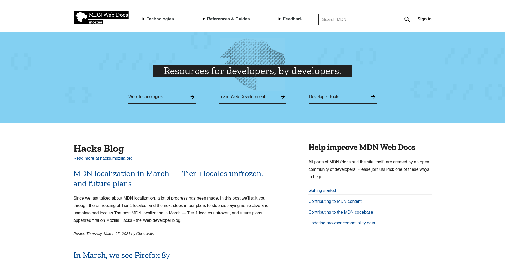
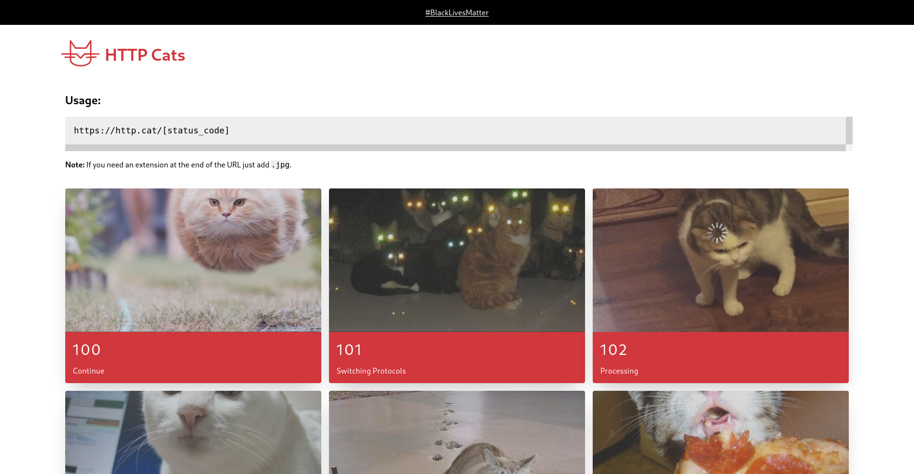
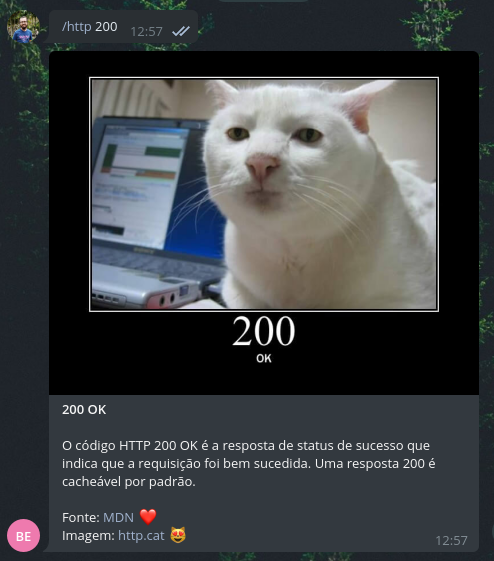
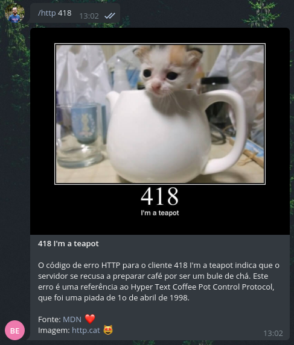

# HTTP Info Bot 🤖

> **http-info-bot** - Chatbot para consulta de informações de códigos HTTP

O bot foi desenvolvido para a plataforma [Telegram](https://telegram.org/). Ele possui apenas uma funcionalidade, fornecer uma breve descrição sobre um código HTTP e imagem para facilitar a interpretação. Para isso a pessoa interessada pode enviar um comando para o bot e informar o código que deseja consultar. No caso do Telegram, seria algo como isso:

```
/http <CODIGO>
```

## MDN Web Docs

O bot fará uma consulta ao site [MDN Web Docs](https://developer.mozilla.org/), para fornecer uma breve descrição textual do código consultado.



Exemplo:

```
/http 200
```
> "O código HTTP 200 OK é a resposta de status de sucesso que indica que a requisição foi bem sucedida. Uma resposta 200 é cacheável por padrão." - (MDN)

## HTTP Cats

Em seguida pegará uma imagem no site [http.cat](https://http.cat/), ele que fornece uma galeria de imagens de gatinhos correspondentes aos códigos de status HTTP.



## Interação com o Bot

Abaixo estão alguns exeplos de inteção com o bot através do Telegram:




